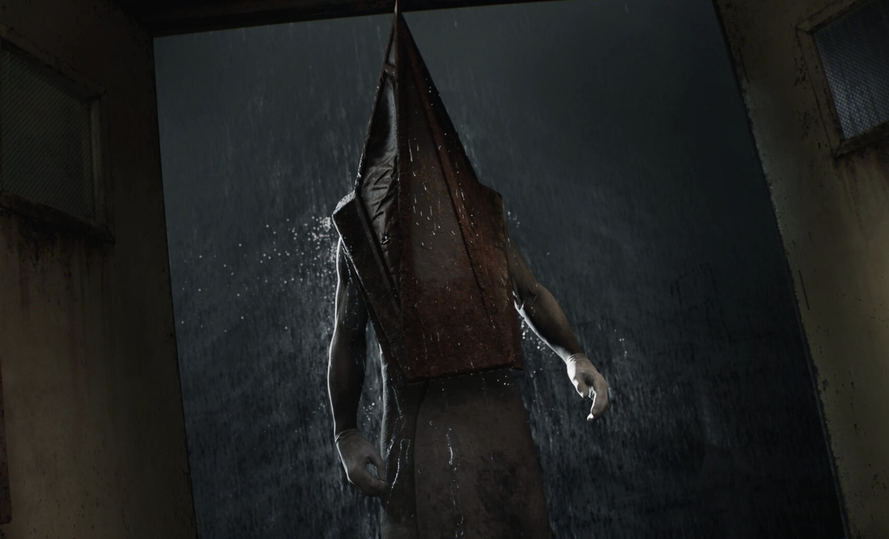

# xiyu0131_9103_tut4
First repository ever made.
100% hand-made lol

## Targeting drawing technique: Raindrop effect

**Examples** 
*Two examples are used to illustrate the raindrop effect.* 

#### Example list
1. The Matrix
2. The Silent Hill

#### Why these examples are chosen
-These two films are both very famous and successful.
-In the matrix example, the raindrops on the window not only look aesthetic, but also enhances the moody atmosphere in that scene.
-In the silent hill example, the raindrops increase the sense of immersion. Also, they made a distinguish between the raindrops on shoulder, in the background, and on the screen.

### Image of Examples

[A link to Silent Hill wikipedia](https://en.wikipedia.org/wiki/Silent_Hill#:~:text=Silent%20Hill[a]%20(Japanese:%20%E3%82%B5%E3%82%A4%E3%83%AC%E3%83%B3%E3%83%88%E3%83%92%E3%83%AB,%20Hepburn:%20Sairento%20Hiru)%20is%20a%20horror)




### code
```
function helloworld(){
    console.log("Hello World!");
}
```

> What is blockquote?